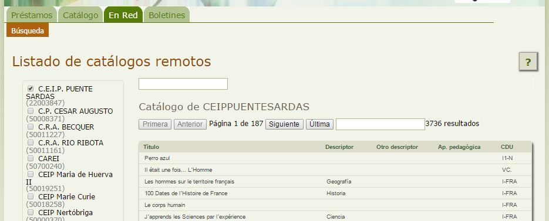

# Consultar catálogos de otras bibliotecas

Además de poder realizar búsquedas sobre la biblioteca de nuestro centro, también podremos consultar los fondos de otras bibliotecas escolares Abiesweb, que en su configuración permitan el acceso externo. 

Para ello haremos click en la Pestaña **En Red**, opción **Búsqueda** y nos aparecerá el listado de Bibliotecas Abiesweb que permiten ser consultadas. 

Haremos click en la casilla de la biblioteca o bibliotecas correspondientes y nos aparecerá su catálogo a la derecha, donde podremos realizar la búsqueda utilizando el cuadro de texto que aparece justo encima de la cabecera de su tabla.

Existe otro cuadro de texto que aparece por encima de los listados de todas las bibliotecas seleccionadas, éste es para buscar cualquier término en los catálogos de todas las bibliotecas seleccionadas, y no en una de ellas en particular.

