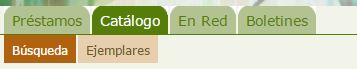
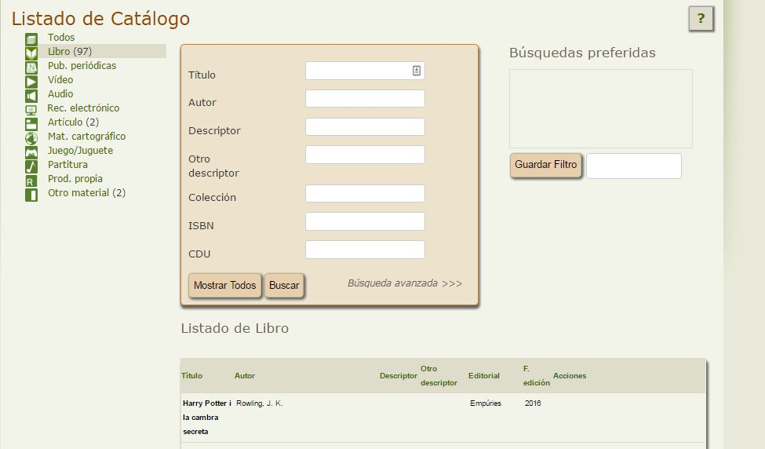

# Consultar el catálogo de fondos de la biblioteca de mi centro

La mayor parte de las veces que accedamos a Abiesweb será para consultar su catálogo con intención de tomar algún ejemplar en préstamo. 

Para ello, una vez hayamos escrito nuestro usuario y contraseña en la página de inicio, haremos click en la pestaña **Catálogo**, opción **Búsqueda**:

En esta página veremos:

A la izquierda una clasificación de fondos en función del tipo de éstos: Libros, Pub.Periódicas, Vídeo, Audio... y entre paréntesis el número de fondos que hay de cada uno de estos tipos.

A la derecha de ésta clasificación, en la zona principal, aparece una serie de campos que nos permiten realizar búsquedas sobre el listado de fondos y cuyo resultado se mostrará en el listado que se ve por debajo de éstos campos.

Una vez localizado el fondos o fondos concretos, simplemente haciendo click sobre su título, se mostrará la ficha con todos sus datos.

