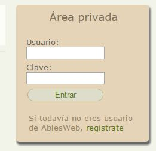
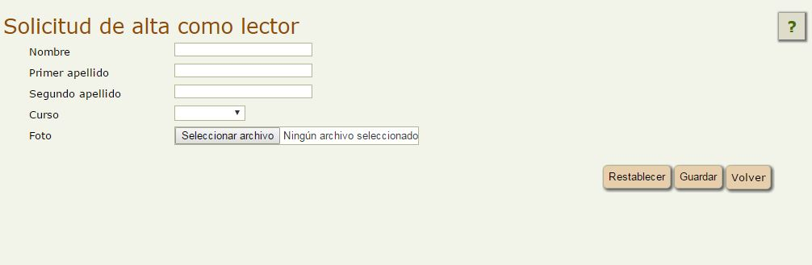

# Darme de alta en Abiesweb para usar la biblioteca de mi centro escolar

Para poder darnos de alta o registrarnos en Abiesweb, será necesario que el Administrador Abiesweb de nuestra biblioteca haya habilitado esta opción para que aparezca en la página de entrada a nuestra biblioteca:

Si hacemos un click sobre **regístrate** nos aparecerá el siguiente formulario de registro, que completaremos y guardaremos.

**El alta requiere de la aprobación de la misma por parte del Bibliotecario, **así que deberemos dirigirnos a él para confirmar nuestro registro y recoger nuestros datos de acceso y carnet de la biblioteca.

 

