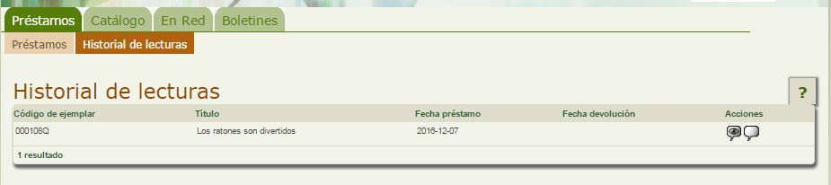

# Escribir una opinión sobre algún fondo de los que hemos tomado en préstamo

Abiesweb permite recoger las opiniones de los lectores sobre los fondos de los cuales han tenido ejemplares prestados, de esta manera, aumentamos la información del mismo y aconsejamos lecturas a otros próximos lectores.

Para poder reflejar nuestra opinión sobre un fondo, deberemos hacer click en la pestaña **Préstamos** y después en la opción **Historial de Lecturas**:

En el listado de nuestras lecturas, vemos que a la derecha de cada una de ellas aparecen los siguientes iconos:

-   Para consultar las opiniones de otros lectores sobre ese fondo. 
-   Para redactar tu opinión sobre este fondo. Ésta opinión no será pública, hasta que no sea aceptada por el bibliotecario.

