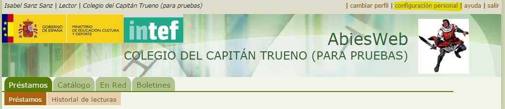
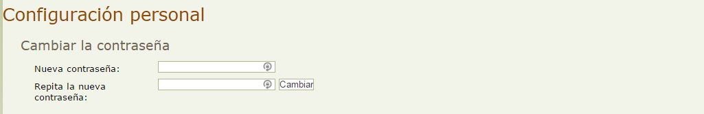

# Modificar mi contraseña de acceso

Cuando nos dan de alta en Abiesweb, nuestro usuario tiene una contraseña inicial que es nuestro nombre de usuario precedido de **pass**

Por ejemplo, si mi nombre de usuario es ****cmab0076** **mi contraseña será ****passcmab0076****

Evidentemente, lo aconsejable es que cada lector modifique su contraseña para preservar la privacidad de sus datos y evitar que su identidad sea suplantada. 

Para ello, simplemente accederemos al menú que aparece en la parte más superior de la página de Abiesweb, donde dice** configuración personal**.

Y desde allí, completaremos la parte en la que nos permite cambiar la contraseña:

