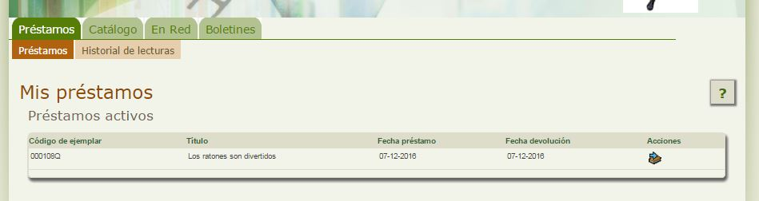

# Solicitar una prórroga del préstamo actual

Una vez he recogido un fondo en préstamo para un número de días, si éstos no son suficientes es posible prorrogar el préstamo simplemente accediendo a Abiesweb.

Desde la pestaña **Préstamos**, opción **préstamos**, podemos consultar el listado de ejemplares que tenemos en préstamo.

A la derecha del préstamo en cuestión, aparece el icono  que nos permitirá realizar la prórroga del mismo, por el número de días que la biblioteca tenga definido.

